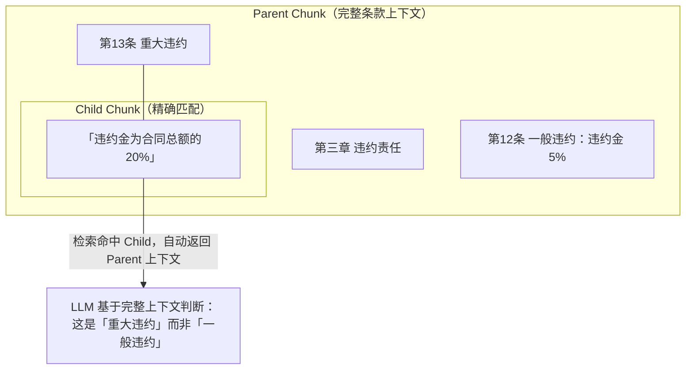

# 2026 开源知识库 RAG 方案深度调研:降幻觉、技术实现与商业可用性全解析

> 类似 Coze 那样,对不同类型文件有完整的 Embedding 参数和前置处理方案,尽可能低幻觉的成熟方案到底怎么选?本文以「降低大模型幻觉」为主线,为你逐层拆解。

## 1. 背景与动机

在构建 AI 知识库系统时,核心挑战是**压低大模型的幻觉**。市面上的 RAG(检索增强生成)框架琳琅满目,但它们的**分块策略、Embedding 配置、文件预处理能力**差异巨大。

> 📊 **市场规模**:据 [Onyx 2026 年企业 RAG 报告](https://onyx.app/insights/enterprise-rag-platforms-2026)(基于 MarketsandMarkets 数据),企业级 RAG 市场在 2025 年已达 **19.4 亿美元**,预计 2030 年增至 **98.6 亿美元**,复合增长率 38.4%。这意味着选型决策越来越关键。

本文从 GitHub 上筛选了 **8 个最主流的开箱即用知识库/RAG 平台**(均为 API + 自带前端,核心定位是知识库),剖析技术实现与开源协议,以**降低幻觉**为核心维度评估。

---

## 2. 项目总览

| 项目 | ⭐ Stars | 核心定位 | 技术栈 | 降幻觉亮点 |
|------|----------|---------|--------|---------|
| **[RAGFlow](https://github.com/infiniflow/ragflow)** | 83.7k | 深度文档理解引擎 | Go / Python / TS | 双流派合一 · 集成 GraphRAG · 可追溯引用 |
| **[Dify](https://github.com/langgenius/dify)** | 146.8k | AI 应用开发平台 | Python / TS | 父子分块 · Knowledge Pipeline |
| **[FastGPT](https://github.com/labring/FastGPT)** | 28.7k | 知识库 + 工作流平台 | TypeScript | 知识库三巨头 · API 兼容 OpenAI |
| **[Onyx (原 Danswer)](https://github.com/onyx-dot-app/onyx)** | 30.6k | 企业知识库搜索 | Python | 40+ 数据源 · 引用溯源 |
| **[AnythingLLM](https://github.com/Mintplex-Labs/anything-llm)** | 62.2k | 全功能桌面端 RAG | TypeScript / Node | 多向量库 · 桌面 GUI |
| **[PrivateGPT](https://github.com/zylon-ai/private-gpt)** | 57.3k | 本地私有知识库 | Python | API-first · 数据不出本地 |
| **[MaxKB](https://github.com/1Panel-dev/MaxKB)** | 21.5k | 开箱即用知识库 | Python / Django / Vue | Docker 一键部署 |
| **[QAnything](https://github.com/netease-youdao/QAnything)** | 14k | 本地知识库问答 | Python | BCEmbedding · 混合检索 |

> ⚠️ **选型前置说明**:本文聚焦"**核心定位是知识库、提供 API、自带前端**"的开箱即用平台。LangChain / LangGraph / LlamaIndex 等更底层框架不在选型范围,**Haystack** 会在第 4 节单独点评。

---

## 3. 核心技术详解

### 3.1 RAGFlow — 降幻觉最强 · 双流派合一(强烈推荐)

**GitHub**: [infiniflow/ragflow](https://github.com/infiniflow/ragflow)

#### 3.1.1 核心理念:Quality in, Quality out

RAGFlow 是开源界在**降低幻觉**方面做得最极致的方案,也是 Relari AI(RAG 评估领域专家 [florinelchis](https://florinelchis.medium.com/top-10-rag-frameworks-on-github-by-stars-january-2026-e6edff1e0d91))认可的"深度文档理解"标杆。设计哲学:**高质量输入 → 高质量输出**。

#### 3.1.2 分块模板(Chunking Templates)— 按文件类型精细配置

RAGFlow 最具特色的设计是**针对不同文件格式提供专用模板**——不是一刀切的分块:

| 模板 | 说明 | 适用文件格式 | 预处理策略 |
|------|------|-------------|-----------|
| **General** | 按预设 token 数顺序分块 | MD, DOCX, XLSX, PPT, PDF, TXT, CSV, JSON, HTML, 图片等 | 通用段落切分 |
| **Q&A** | 检索相关信息并生成问答对 | XLSX, CSV/TXT | 结构化问答对提取 |
| **Table** | 使用 TSI 技术高效解析表格 | XLSX, CSV/TXT | 表格结构保留 |
| **Book** | 书籍/长文档优化 | DOCX, PDF, TXT | 章节结构感知 |
| **Laws** | 法律法规文档 | DOCX, PDF, TXT | 条款级精确分割 |
| **Paper** | 学术论文 | PDF | 摘要/正文/参考文献分区 |
| **Presentation** | 演示文稿 | PDF, PPTX | 幻灯片级别分块 |
| **Resume** | 简历(企业版) | DOCX, PDF, TXT | 字段结构化 |
| **Picture** | 图片/扫描件 | JPEG, PNG, GIF, TIF | OCR + 视觉理解 |
| **One** | 整文档作为单个 chunk | DOCX, XLSX, PDF, TXT | 不切分,保持完整 |
| **Manual** | 手动标注 | PDF | 人工干预分块 |
| **Tag** | 标签集合模式 | XLSX, CSV/TXT | 自动打标分类 |

#### 3.1.3 父子分块策略(Parent-Child Chunking)— 抗幻觉核心机制

RAGFlow v0.23.0+ 引入父子分块:

> **问题本质**:传统 RAG 中单一 chunk 同时承担「语义匹配(召回)」和「上下文理解(生成)」两个**内在冲突**的目标。
>
> **解决方案**:
> 1. 文档先被分割为较大的 **Parent Chunk**(保持语义完整性)
> 2. 每个 Parent 再细分为多个 **Child Chunk**(用于精确定位)
> 3. **检索时**:先用 Child Chunk 精准定位 → **自动关联返回 Parent Chunk** 提供完整上下文
> 4. LLM 基于完整上下文生成答案

**实际案例**:《合规手册》中查询"违约责任"



没有 Parent 上下文的情况下,LLM 可能将"违约金 20%"错误归类到一般违约条款。

#### 3.1.4 双流派合一:已集成 GraphRAG

> 这是 RAGFlow 在 2025 年的关键升级。

降幻觉有两大流派(详见第 4 节),RAGFlow 把**两者都内置**:

| 模式 | 实体抽取策略 | 适用场景 |
|------|------------|---------|
| **Light 模式** | 采用 **LightRAG** 的实体抽取 prompt | 轻量、省 token,日常问答 |
| **General 模式** | 采用微软 **GraphRAG** 的 prompt | 更全面的关系抽取,复杂多跳推理 |

意味着你**不需要在"输入质量派"和"知识图谱派"之间二选一**——这是 Dify/FastGPT 等其他平台目前都没有的能力。

#### 3.1.5 Embedding 配置要点

- **模型选择**:支持 OpenAI / Azure / Ollama / 本地 TEI(Text Embeddings Inference)等
- **关键约束**:一个 Dataset 内所有文件**必须使用同一个 Embedding 模型**(保证同一向量空间可比)
- **语言注意**:部分模型针对特定语言优化,跨语言使用会降低性能
- **切换代价**:更换 Embedding 模型需要删除已有 chunks 并重建索引

#### 3.1.6 完整抗幻觉技术栈

| 层级 | 技术 | 说明 |
|------|------|------|
| 输入质量 | 深度文档理解 | 版面分析 + OCR + 表格识别,非简单文本提取 |
| 输入质量 | 模板化分块 | 12 种模板适配不同文件格式 |
| 输入质量 | 人工干预接口 | 可视化查看/修正分块结果 |
| 检索质量 | 父子分块 | 精确定位 + 完整上下文 |
| 检索质量 | 混合检索 | 向量 + 全文检索 + 重排(Rerank) |
| 检索质量 | **知识图谱** | LightRAG / GraphRAG 双模式,降多跳推理幻觉 |
| 生成质量 | 可追溯引用 | 每个答案标注来源 chunk |
| 生成质量 | Context Window 控制 | 限制输入 LLM 的上下文长度 |

#### 3.1.7 支持的文件预处理

- **23 种格式**的版式解析(OCR 准确率 98%):Word / Slides / Excel / TXT / 图片 / 扫描件 / 结构化数据 / 网页等
- **数据源集成**:Confluence / S3 / Notion / Discord / Google Drive 等
- **PDF 解析器可选**:DeepDoc(内置,中文 OCR 友好)/ [**MinerU 3.4**](https://github.com/opendatalab/MinerU/releases/tag/mineru-3.4.0-released) / Docling / [**PaddleOCR-VL-1.6**](https://www.paddleocr.ai/main/en/version3.x/algorithm/PaddleOCR-VL/PaddleOCR-VL-1.6.html) / TextIn(中英混排选型详见第 6.4 节)
- **Excel2HTML**:复杂 Excel 转换为 HTML 表格保留结构

---

### 3.2 Dify — 最灵活的可视化流水线

**GitHub**: [langgenius/dify](https://github.com/langgenius/dify)

> Dify 是 [florinelchis 2026 年榜单](https://florinelchis.medium.com/top-10-rag-frameworks-on-github-by-stars-january-2026-e6edff1e0d91)中增长最快的 AI 项目之一,定位是 AI 应用开发平台(含强大的知识库模块)。**它既能开独立对话页面、又支持 API,还能直接嵌入外部 Web 站点**——在前端体验上比 RAGFlow 更完整。

#### 3.2.1 架构设计:ETL 四阶段(Knowledge Pipeline)

```
Extract(数据提取)
    ↓
Transform(数据转换)
    ├── Parse(文档解析)   ← 选择最优解析器
    ├── Enrich(内容增强)   ← LLM 实体抽取 / Code 规则清洗
    ├── Chunk(文本分块)    ← 三种策略
    └── Embed(向量化)     ← 多供应商可选
    ↓
Load(加载入库)           ← 向量数据库 + 元数据过滤
```

#### 3.2.2 三种分块策略对比

| 策略 | 适用场景 | 核心特点 | 推荐场景 |
|------|---------|---------|---------|
| **General(通用 ECO)** | 大批量普通文档 | 按段落分块 + 经济型索引 | 新闻、博客、通用文档 |
| **Parent-Child(父子 HQ)** | 长技术文档/报告 | 层级分块,兼顾精度与全局上下文 | API 文档、技术手册、研究报告 |
| **Q&A(问答模式)** | 结构化表格数据 | 从表格列提取 QA 对,支持自然语言查询 | 产品目录、FAQ 表格、价格表 |

#### 3.2.3 内置 Pipeline 模板(7 个)

| 模板名称 | 用途 | 核心节点 |
|---------|------|---------|
| General document processing (ECO) | 通用文档处理 | Extract → Parse → General Chunk → Embed |
| Long document processing (HQ) | 长文档处理 | Extract → Parse → Parent-Child Chunk → Embed |
| Table data extraction (Simple Q&A) | 表格数据提取 | Extract → Parse → Q&A Chunk → Embed |
| Complex PDF with Images & Tables | 复杂 PDF 处理 | Extract → OCR Parse → Image/Table Extract → Multimodal Embed |
| Multimodal enrichment (LLM) | 多模态增强 | Extract → Parse → LLM Describe Images → Embed |
| Convert to Markdown | 格式转换 | Extract → Office → Markdown Converter |
| Intelligent Q&A generation | 智能 QA 生成 | Extract → Parse → LLM Generate Q&A → Embed |

#### 3.2.4 Embedding 与多模态配置

- **多供应商支持**:OpenAI / Azure / Voyage / 本地 Ollama / Xinference 等
- **选择维度**:按成本、语言、向量维度选择
- **多模态 Embedding**:标记 VISION 图标的模型可同时嵌入文本和图片
- **每个 chunk 最多 10 张图片附件**

#### 3.2.5 可观测性优势

- **Test Run**:逐步测试整个流程
- **Variable Inspect**:实时查看每步输入输出
- 快速定位解析错误 / 分块问题 / 元数据缺失

---

### 3.3 FastGPT — 中文知识库三巨头之一

**GitHub**: [labring/FastGPT](https://github.com/labring/FastGPT)

中文社区和 Dify、RAGFlow 并列的三大知识库平台([知乎横评共识](https://zhuanlan.zhihu.com/p/1908668807607751251):"**FastGPT 是知识库小能手**"),由 Sealos 团队(labring)出品,定位是**知识库 + 可视化工作流**,API 兼容 OpenAI 标准。

#### 3.3.1 核心特点

- **知识库效果好**:针对中文知识库场景做了深度优化,检索质量在轻量平台中突出
- **API 兼容 OpenAI**:可直接用 OpenAI SDK 调用,接入成本极低
- **可视化工作流**:编排复杂问答流程,适合智能客服、FAQ 系统
- **轻量易部署**:相比 RAGFlow 资源占用更小,快速原型验证友好

#### 3.3.2 降幻觉机制

- **混合检索**:向量 + 全文检索,支持重排
- **引用溯源**:答案标注来源文档
- **数据集分级管理**:按业务维度(产品/售后/技术)分类知识库,提升检索精度

#### 3.3.3 适用场景

- 企业智能客服、FAQ 知识库
- 需要 OpenAI 兼容 API 快速接入的场景
- 团队希望低门槛搭建知识库工作流

> 📌 **协议提醒**:FastGPT 采用 Apache-2.0 + 附加条款,**多租户 SaaS 需书面授权、不可去 LOGO**(详见第 7 节)。

---

### 3.4 Onyx(原 Danswer)— 企业知识库搜索

**GitHub**: [onyx-dot-app/onyx](https://github.com/onyx-dot-app/onyx)

Onyx(前身 Danswer)是**企业级 AI 知识库搜索平台**,定位对标 Glean——连接企业内部各种数据源,做统一的 AI 问答与搜索。它是英文专业圈企业 RAG 领域的标杆。

#### 3.4.1 核心特点

- **40+ 数据源连接器**:Google Drive、Slack、Confluence、Notion、GitHub、Jira 等,自动同步企业知识
- **完整 REST API + 产品级前端**:开箱即用,部署即有 API 和管理界面
- **引用溯源**:每个答案标注来源文档和段落,企业可审计
- **权限感知**:尊重数据源原有的访问权限,企业级安全

#### 3.4.2 降幻觉机制

- **多源混合检索**:跨数据源的语义 + 关键词检索
- **重排(Rerank)**:内置 reranker 提升相关性
- **引用强制**:答案必须挂来源,降低无中生有

#### 3.4.3 独特的商业模式:Open-Core

Onyx 采用 **open-core** 模式:核心代码 MIT 许可,企业级功能(SSO、高级权限、审计)放在 `ee/` 目录下使用独立的 Onyx Enterprise License。这与 Dify/FastGPT 的"修改版 Apache + 附加条款"是两条不同的开源商业化路线(详见第 7 节)。

#### 3.4.4 适用场景

- 中大型企业的内部知识库 / AI 搜索
- 需要连接众多 SaaS 数据源做统一问答
- 重视权限隔离与可审计性的场景

---

### 3.5 PrivateGPT — 本地私有知识库

**GitHub**: [zylon-ai/private-gpt](https://github.com/zylon-ai/private-gpt)

PrivateGPT 是"**本地私有知识库**"的代名词,由 Zylon 出品,**核心设计就是 API-first**:提供完整的 REST API,让你把私有文档做成知识库后程序化调用,**数据 100% 不出本地**。

#### 3.5.1 核心特点

- **API-first 设计**:完整的 RESTful API,无需写集成代码即可调用
- **完全本地化**:支持本地 LLM + 本地 Embedding,断网可用,数据隐私无忧
- **自带前端**:Gradio 界面可简单查看文档和问答(前端是 demo 级,主交互靠 API)
- **文档解析**:支持 PDF、Word、PPT、HTML、Markdown 等主流格式

#### 3.5.2 降幻觉机制

- **完全 RAG 流水线**:分块 + 向量化 + 检索 + 引用
- **上下文隔离**:不依赖外部模型参数记忆,纯基于注入文档回答
- **可配置检索**:支持调整 chunk size、top-k、相似度阈值

#### 3.5.3 适用场景

- **隐私敏感场景**:法律、医疗、金融等数据不能上云的领域
- **离线/内网部署**:无外网环境下的知识库
- **API 接入**:需要把私有知识库作为后端服务集成到自己的应用

> 57k+ Stars,Apache-2.0 协议,商用友好。

---

### 3.6 QAnything(网易有道)— 本地化优先(基本停滞)

**GitHub**: [netease-youdao/QAnything](https://github.com/netease-youdao/QAnything)

#### 3.6.1 核心特点

- **纯本地部署**,支持离线安装(拔网线可用)
- **混合检索**:BM25(关键词)+ Embedding(向量)
- 自研 [**BCEmbedding**](https://huggingface.co/maidalun1020/bce-embedding-base_v1) 模型(下载量 60 万+)
- 所有答案**精准溯源**

#### 3.6.2 支持文件格式

PDF / Word(docx) / PPT(pptx) / XLS(xlsx) / Markdown(md) / EML / TXT / 图片(jpg/png) / CSV / 网页链接(html) / 音频(mp3/wav)

#### 3.6.3 重要提醒:协议与活跃度

> **协议更正**:QAnything 实际采用 **AGPL-3.0** 协议(强网络传染,SaaS 也需开源),**并非宽松协议**——做商业产品务必注意。
>
> **活跃度**:该项目自 2025 年 3 月后基本停止更新,建议作为参考学习,**不建议作为新项目的生产选型**。

---

### 3.7 MaxKB & AnythingLLM — 轻量快速方案

| 特性 | MaxKB | AnythingLLM |
|------|-------|------------|
| 定位 | 开箱即用知识库 | 桌面端全功能 RAG |
| 部署方式 | Docker 一行命令 | 桌面应用 / Docker |
| 默认 Embedding | text2vec-base-Chinese | 可配置 |
| 向量数据库 | PostgreSQL/pgvector | Chroma / Qdrant / Drizzle 等 |
| 分块策略 | 通用型自动拆分 | 可调 chunk size |
| 适合场景 | 快速验证 POC | 个人/小团队使用 |

> 这两个项目更适合**快速验证概念**或**个人/小团队内部使用**,在生产级复杂场景下不如前三者强大。

---

## 4. 降幻觉专题:两大流派 + 5 大技术杠杆

> **选知识库,本质是选降幻觉方案**。理解原理才能在任何项目间做对判断。

### 4.1 RAG 架构演进:从朴素到自主(Agentic RAG 元年)

> **选知识库,本质是选一代架构**——不同代际解决不同问题,盲目上最新代际反而烧钱烧延迟。

RAG 这几年走过四个台阶,每一代都在补上一代的短板:

| 代际 | 核心动作 | 多跳/全局 | 自纠错 | 典型成本 | 适用场景 |
|------|---------|----------|--------|---------|---------|
| **Naive RAG(朴素)** | 向量 Top-K → 拼 prompt → 生成 | ❌ | ❌ | 极低 | FAQ、单篇事实问答 |
| **Advanced RAG(进阶)** | +检索前改写/HyDE +检索后重排 | 弱 | ❌ | 低 | 企业问答甜点区 |
| **GraphRAG(图谱)** | 知识图谱 + 社区摘要 | ✅ 强 | ❌ | **索引高** | 科研/法律/全局归纳 |
| **Agentic RAG(自主)** | Agent 动态选源 + 迭代检索 + 评估重试 | ✅ 强 | ✅ | **查询高(多轮)** | 复杂推理、企业级主流 |

> ⚠️ **2026 是「Agentic RAG 元年」**:学术综述 [arXiv 2501.09136《Agentic RAG: A Survey》](https://arxiv.org/abs/2501.09136)直言,Naive RAG 在生产级应用里**「基本已死」**——它撑不住复杂、多步、需要推理的真实查询,Agentic 已成为企业级 RAG 的主流模式。

#### 4.1.1 Agentic RAG:从「流水线」到「决策系统」

Naive/Advanced RAG 是**死流水线**:检索一次 → 生成,捞错了也照样硬编一段。Agentic RAG 在检索外层套一个会做决策的 Agent,核心是四个智能体模式——**反思(Reflection)、规划(Planning)、工具调用(Tool Use)、多智能体协作**。它不再「检索一次就交卷」,而是:

1. 分析用户意图、拆解子问题
2. **动态选数据源**(向量库 / 关键词 / 知识图谱 / 网络搜索)
3. 执行检索 → **评估召回证据够不够**
4. 不够就**改写查询、换工具、或回退网络搜索重试**,直到满意或烧完预算

最常见的两种落地架构:

| 架构 | 机制 | 特点 |
|------|------|------|
| **Corrective RAG(纠错型)** | 五个专职 Agent:检索 / 相关性评估 / 查询改写 / 外部知识补充 / 答案合成,相关性不达标自动触发纠错 | 证据质量有保障 |
| **Adaptive RAG(自适应)** | 先用分类器判断问题复杂度,简单问题直接跳过检索,复杂问题才走多步迭代 | **省钱又保质**,压成本首选 |

> 💡 **成本警示**:Agentic RAG 的成本来自**多轮 LLM 调用**(改写、评估、重试)。务必设**最大轮次 + 预算上限**,否则一个难题能让 Agent 反复改写检索把 token 烧穿。降成本的关键是 Adaptive 模式(简单问题跳过检索)+ Prompt Caching。

#### 4.1.2 怎么选范式(按问题类型,不是越新越好)

| 你的问题主要是… | 推荐范式 | 理由 |
|----------------|---------|------|
| 单文档事实问答、FAQ | **Advanced RAG(向量+重排)** | 性价比最高,杀鸡不用牛刀 |
| 跨文档对比、全局主题归纳 | **GraphRAG(优先 Lazy 版)** | 向量 RAG 的死穴 |
| 需要自动选源、自我纠错、接多工具 | **Agentic RAG** | 复杂推理、企业级主流 |

> 这条纵轴也解释了第 3 节各平台的定位:RAGFlow 主打「双流派融合」(Advanced + GraphRAG),Dify 已用 Agent 节点支持 Agentic RAG。**真正落地的关键是控制变量、做评估集、按成本选型,而不是无脑堆最复杂的架构**([四范式实测对比](https://www.joinlearn.com/blog/agentic-rag-graphrag-guide))。

### 4.2 为什么要单独讲降幻觉?

RAG 相比裸 LLM 能显著降低幻觉,但**不能消除**。Onyx 2026 企业报告指出,降低幻觉的关键手段是:**重排(Reranking)、混合检索(Hybrid Search)、引用(Citation)**。而业界在工程实践中,逐渐演化出**两大互补的降幻觉流派**。

### 4.3 流派 A:输入质量派(代表:RAGFlow)

**核心思想**:"Garbage in, garbage out" 的反面——**答案准不准,80% 取决于喂给模型的上下文质量**。

**技术栈**:深度文档解析(版面分析 + OCR + 表格识别)→ 模板化分块 → 父子分块 → 混合检索 → 重排 → 引用溯源

**擅长降的幻觉**:**事实性幻觉**——答案与原文不符、断章取义、张冠李戴。

### 4.4 流派 B:结构化推理派(代表:GraphRAG / LightRAG)

**核心思想**:传统向量 RAG 擅长"相似匹配",但**不擅长推理**。把文档抽成"实体 + 关系"的知识图谱,就能做跨文档的多跳推理和全局理解。

**为什么需要它**:向量检索的天然短板——
- 问"这个项目整体风险在哪?" → 需要全局综合,向量只能给碎片
- 问"张三的同事的老板是谁?" → 需要多跳,向量会丢失关系链
- 问"统计类/聚合类问题" → 向量 RAG 会系统性幻觉(编造数字)

**有硬数据支撑**:[ACL 2025 一篇论文(GenAIK @ COLING,基于 FinanceBench 测试)](https://aclanthology.org/2025.genaik-1.6/)实测,**GraphRAG 相比传统向量 RAG:幻觉率降低 6%,同时 token 消耗降低 80%**。[AWS Strands 的对比实验(2026-02)](https://dev.to/aws/rag-vs-graphrag-when-agents-hallucinate-answers-2mcb)也证实传统 RAG 在统计/聚合问题上系统性幻觉,GraphRAG 显著缓解。

**降的幻觉**:**关系/推理类幻觉**——跨文档推理、全局总结、多跳问答时编造。

#### 4.4.1 LightRAG:GraphRAG 的轻量化

LightRAG(港大出品)是微软 GraphRAG 的简化版,去掉了昂贵的社区结构,保留核心的实体-关系图谱 + 双层检索(局部实体 + 全局关系),大幅降低 token 成本。

```
传统向量 RAG: Query → 向量检索 → 碎片化文本 → LLM(易丢失全局信息,推理类问题幻觉)

LightRAG/GraphRAG: Query → 关键词提取
                       ├──→ 局部检索(实体向量库)──┐
                       ├──→ 全局检索(关系向量库)──┤
                       └──→ 原始 chunk 检索 ───────┤
                                                  ↓
                                          融合结果 → LLM 生成
```

#### 4.4.2 GraphRAG 成本悬崖与新家族(2026 更新)

LightRAG 之外,2025-2026 涌现了一批更高性价比的图增强 RAG,把 GraphRAG「索引太贵」的老问题打穿:

| 方案 | 来源 | 核心改进 | 关键数据 |
|------|------|---------|---------|
| **LazyGraphRAG** | 微软研究院 | 把 LLM 调用**推迟到查询时**,索引阶段只做轻量名词短语抽取 | 索引成本仅全 GraphRAG 的 **0.1%**(与向量 RAG 持平),全局查询成本低 **700 倍**([微软官方博客](https://www.microsoft.com/en-us/research/blog/lazygraphrag-setting-a-new-standard-for-quality-and-cost/)) |
| **HippoRAG** | 俄亥俄州立大学 NLP | 模拟人脑海马体的记忆索引 | 多跳推理准确率相当,成本仅 **1/10 ~ 1/30** |
| **PathRAG** | 学术开源 | 对图谱做**路径剪枝**,只保留与查询相关的路径 | 上下文窗口占用 **-44%**,延迟与 token 双降 |
| **OG-RAG** | 学术开源 | 本体(Ontology)接地,约束生成在领域本体上 | 幻觉率 **-40%** |

> 📊 **成本悬崖的崩塌**:微软原版 GraphRAG 在 2024 年索引一个企业语料库要约 **3.3 万美元**,18 个月后 LazyGraphRAG 降到 **33 美元上下**——降了 **1000 倍**,而多跳准确率的优势没丢([生产数据复盘](https://agentmarketcap.ai/blog/2026/05/02/graphrag-vs-vector-rag-production-agent-pipelines))。这正是 RAGFlow 把图谱做成「可选模式」、且默认走轻量路线的工程原因。
>
> 微软 GraphRAG 官方仓库([github.com/microsoft/graphrag](https://github.com/microsoft/graphrag))截至 2026-05 已发布 **v3.1.0**,生产可用性持续提升。新家族数据综合自 [TianPan 2026 架构决策指南](https://tianpan.co/blog/2026-04-19-graphrag-vs-vector-rag-architecture-decision)与微软 LazyGraphRAG 博客。

### 4.5 降幻觉 5 大技术杠杆(评估任何知识库的通用标准)

完整的检索质量优化分**检索前 / 检索中 / 检索后**三段。下面 5 大杠杆覆盖「检索中 + 检索后」,但**检索前的查询优化**同样关键——用户原话往往不适合直接拿去检索,先做一轮改写能显著提升召回:

| 检索前技术 | 原理 | 适用 |
|----------|------|------|
| **查询重写(Query Rewriting)** | 用 LLM 把口语化问题改成更适合向量匹配的表述 | 问题表述模糊、含指代 |
| **HyDE(假设性文档嵌入)** | 先让 LLM 生成一个「假想答案」,用它去检索——假想答案与真实文档语义更近 | 复杂问题、零样本检索,业界实测**召回 +15~20%** |
| **Multi-Query 多查询扩展** | 把一个问题改写成多个子问题,分别检索再合并 | 多角度、跨领域问题 |
| **RRF 倒数排名融合** | 多路召回(向量 + BM25 + 图谱)结果按排名融合,不看绝对分只看排名 | 混合检索标配,比单路 **+10~30%** |

> 检索前优化与 RRF 融合综合参考 [puppylpg《RAG 的工程深度》](https://puppylpg.github.io/ai/2026/06/13/rag-core-knowledge/)。

| 杠杆 | 作用 | 实测收益 | 谁做得好 |
|------|------|---------|---------|
| **1. 重排 Rerank** | 用 cross-encoder 对 top-k 结果重排序,过滤噪声 | **相关性 +10~30%**([NVIDIA 实测](https://developer.nvidia.com/blog/how-using-a-reranking-microservice-can-improve-accuracy-and-costs-of-information-retrieval/),性价比最高) | RAGFlow / Dify / Haystack / Onyx |
| **2. 混合检索** | 向量 + BM25 全文,互补语义与关键词 | 显著降低漏召 | RAGFlow / FastGPT / Dify |
| **3. 引用溯源 Citation** | 答案必须挂来源 chunk | 强制基于证据,可追溯 | RAGFlow / Dify / Onyx |
| **4. 父子分块** | 召回子块、返回父块上下文 | 避免断章取义 | RAGFlow / Dify(HQ 模式) |
| **5. 知识图谱** | 实体-关系推理 | 多跳推理幻觉 -6%,token -80% | RAGFlow(内置)/ LightRAG / GraphRAG |

> 💡 **实战建议**:重排(Rerank)是被严重低估的杠杆。原理是**两阶段检索**:Bi-Encoder(双编码器)粗排快但粗——把几百字压成一个向量,细节被「平均」掉;Cross-Encoder(交叉编码器)精排慢但准——把查询和文档拼在一起逐词交互。先用粗排从全库筛 Top-50/100,再用精排定 Top-5/10。实测收益按场景分化:**复杂查询准确率 +40~50%、简单事实查询 +18%、模糊查询 +30~40%**,Databricks 测试还显示重排能让**幻觉率降 ~35%**([工程深度复盘](https://puppylpg.github.io/ai/2026/06/13/rag-core-knowledge/))。一个 API 调用(Cohere Rerank / BGE-Reranker)就能换来——**是投入产出比最高的降幻觉优化**,知识库没有 Rerank,优先补上。

### 4.6 框架派速览:Haystack / LlamaIndex / txtai / Pathway

如果你不满足于开箱即用平台,需要**自己组装生产级 RAG 流水线**,以下是英文专业圈([florinelchis 2026 榜单](https://florinelchis.medium.com/top-10-rag-frameworks-on-github-by-stars-january-2026-e6edff1e0d91))力推的纯 RAG 框架。

> ⚠️ **注意**:以下都是**需要自己写代码集成的框架/库,不是开箱即用平台**(无现成知识库前端、需自行搭建后端)。

| 框架 | ⭐ Stars | 协议 | 定位 | 降幻觉 / 核心价值 |
|------|---------|------|------|------------------|
| **[Haystack](https://github.com/deepset-ai/haystack)** (deepset) | 25.7k | Apache-2.0 | 生产级 RAG/QA pipeline | 架构清晰 + 重排 + RAGAS 评估最完整;**客户 The Economist / Oxford UP / 政府** |
| **[LlamaIndex](https://github.com/run-llama/llama_index)** | 50.5k | MIT | 数据框架 | 150+ 数据连接器,文档检索专精(比 LangChain 更纯粹) |
| **[Pathway](https://github.com/pathwaycom/pathway)** | 62.8k | 自定义 | 实时数据 RAG | 实时索引 + 流式增量更新,知识库频繁变动场景最优 |
| **[txtai](https://github.com/neuml/txtai)** | 12.7k | Apache-2.0 | all-in-one embeddings+RAG | 内置向量库,本地/离线 RAG,轻量自包含 |

> 💡 **平台 vs 框架怎么选**:开箱即用平台(RAGFlow/Dify 等)部署即用、自带前端和 API;框架(Haystack 等)灵活可控、可深度定制,但要自己写后端和前端。**团队有工程能力且需要极致定制时选框架,追求快速落地时选平台。** Haystack 是企业级首选(有重量级背书),LlamaIndex 适合数据密集型检索,Pathway 适合实时场景,txtai 适合本地/边缘部署。

---

## 5. 真实案例与实测效果

> 前面讲的都是"能力",这一节讲"证据"。选型不能只听厂商自述,要看真实落地数据。以下案例与评测均来自公开来源,已标注出处。

### 5.1 真实生产案例

#### 5.1.1 Onyx @ Univeris(加拿大金融科技公司,约 150 人团队)

这是目前公开最完整的开源 RAG 企业生产案例([LinkedIn,工程师 Mike Sidorenko,2025-06](https://www.linkedin.com/pulse/enterprise-onyx-from-deployment-production-ready-ai-mike-sidorenko-vqnwc)):

| 指标 | 实测数据 |
|------|---------|
| 索引文档量 | **110 万+ 篇** |
| 数据源连接器 | 565 个 |
| 平均搜索响应时间 | **0.4 秒**(顶级企业性能) |
| 2 个月采用情况 | 3,665 条消息 / 93 活跃用户 / 1,190 聊天会话 |
| 用户参与度 | 每用户 39.4 条消息(高粘性) |

> Univeris 基于 Onyx 的开源后端做了深度定制:自研 GitLab 代码索引(JavaParser + Roslyn 语义分析)、Confluence/Jira 附件索引,并基于学术研究做 Prompt 工程(角色分配让输出正确性 +60%、强制语言指令让合规性 +75%)——这是它能在 110 万文档规模下保持 0.4s 响应的关键。

#### 5.1.2 Dify 官方案例

[Dify 官方博客](https://dify.ai/blog/how-dify-ai-powers-the-company-that-is-powering-the-world)分享:某公司用 Dify 搭建内部 AI 应用后,**单次分析任务时间从 8 小时降到 3 小时**;[PingCap 案例](https://www.pingcap.com/case-study/dify-consolidates-massive-database-containers-into-one-unified-system-with-tidb/)显示 Dify 自身也用 TiDB 统一了海量数据库容器,支撑其规模化部署。

#### 5.1.3 FastGPT「标签法」实战([知乎专栏「启迪Prompter」](https://zhuanlan.zhihu.com/p/1932186076337898898))

电网故障问答助手案例:面对「输电/配电 × 诊断/处理」多领域知识,**用 FastGPT 的「集合元数据过滤 + 工作流问题分类」标签法,让多知识库问答准确率提升 80%**。

> 作者的核心洞察:**「知识/数据源 + 工作流是核心,平台(FastGPT/Dify/n8n/扣子)只是地基。」** ——平台决定下限,知识治理与工作流决定上限。

### 5.2 降幻觉实测数据(GraphRAG vs 向量 RAG)

| 场景 | 结论 | 来源 |
|------|------|------|
| **单跳简单问题** | 向量 RAG 准确率 **68.73%**,反而优于 GraphRAG | [Tailored AI / arXiv 2502.11371](https://tailoredai.substack.com/p/rag-vs-graphrag-a-performance-analysis)(Llama 3.1-8B) |
| **多跳推理问题** | GraphRAG 显著优于向量 RAG | 同上 |
| **RAG + GraphRAG 混合** | 比单一方法 **+6.4%**(MultiHop-RAG, Llama 3.1-70B),但成本 1.5~2x | 同上 |
| **图增强 RAG 多跳推理** | 准确率约 **2x**([NVIDIA 实测](https://developer.nvidia.com/blog/boosting-qa-accuracy-with-graphrag-using-pyg-and-graph-databases/)) | NVIDIA PyG + GraphRAG |

更新到 2026 年,生产级实测数据:

| 场景(2026 生产实测) | 向量 RAG | GraphRAG | 来源 |
|-------------------|---------|----------|------|
| **多跳推理任务** | 32% | **86%**(差 54 个百分点) | [TianPan 2026-04](https://tianpan.co/blog/2026-04-19-graphrag-vs-vector-rag-architecture-decision) |
| **企业 KPI / 聚合查询** | **降到 0%** | 维持 **90%** | 同上 |
| **10+ 实体的复杂查询** | 降到 0% | 维持 **70%+** | 同上 |
| **简单事实查询** | **~72%** | ~62%(反而更低) | [AgentMarketCap 2026-05](https://agentmarketcap.ai/blog/2026/05/02/graphrag-vs-vector-rag-production-agent-pipelines) |
| **金融团队生产切换** | multi-hop 43% | **91%**,查询成本降 **97%**,2 个月**零幻觉** | 同上 |
| **Diffbot KG-LM 综合** | 基准 | GraphRAG 准确率是其 **3.4 倍** | 同上 |

> ⚠️ **重要纠偏**:一个常见误区是「GraphRAG 一定比向量 RAG 好」。实测数据恰恰相反——**简单事实检索,RAG 更快更准;GraphRAG 只在多跳推理/关系类问题上才占优**。两者是互补而非替代。这正解释了为什么 RAGFlow 选择「双模式」(检索用向量、推理用图谱)而非二选一。

#### 5.2.1 成本对比:LightRAG 的杀手锏

- **[LightRAG 查询阶段 token 成本比微软 GraphRAG 低约 6000 倍](https://www.ragdollai.io/blog/lightrag-vector-rags-speed-meets-graph-reasoning-at-1-100th-the-cost)**(GraphRAG 单次检索约 61 万 token,LightRAG 不足 100;索引成本相当)——这是它在中端市场胜出的关键
- **微软 LazyGraphRAG**:索引成本仅全 GraphRAG 的 **0.1%**,查询成本 **4%**,效果却超过 GraphRAG Global Search
- 这解释了 RAGFlow 为什么把 LightRAG 作为默认图谱模式(省 token),把 GraphRAG prompt 作为可选的高精度模式

### 5.3 客观反面声音:RAGFlow 也有短板

- **[知乎评测](https://zhuanlan.zhihu.com/p/1974251848698467673)**(*search 效果碾压 chat,但 SDK 是真坑*):RAGFlow 的 **search 检索模式效果远强于 chat 对话模式**,但 SDK 开发体验有坑
- **[CSDN RAGAS 评测](https://blog.csdn.net/m0_59235945/article/details/153839845)**:用 RAGAS 对 RAGFlow 做 5 组配置对比,发现高精度配置在部分数据上反而失效

> **结论**:RAGFlow 的优势集中在 **search(检索)+ 复杂文档解析**;**chat(对话生成)模式和 SDK 体验仍是短板**。以上结论以 demo 为准,生产需实测验证。

### 5.4 怎么量化降幻觉效果(评估闭环)

> 第 9.5 节那句「别跳过检索测试上线」,在这里展开成方法论。

**第一步:把检索和生成拆开评估**。

> ⚠️ **硬数据**:**73% 的 RAG 系统失败发生在检索阶段,而非生成阶段**([TianPan 2026](https://tianpan.co/blog/2026-04-19-graphrag-vs-vector-rag-architecture-decision))。如果不拆开,你永远不知道是「没召回到」还是「召回到了但模型没用好」,优化方向会完全跑偏。

| 评估层 | 指标 | 衡量什么 |
|--------|------|---------|
| **检索质量** | Recall@K | 找全了没有(漏召) |
| | Precision@K | 找对了没有(噪召) |
| | NDCG / MRR | 排得对不对(高度相关的是否靠前) |
| **生成质量** | **Faithfulness(忠实度)** | 答案是否忠实于检索文档——**直接量化幻觉** |
| | Answer Relevance | 是否真正回答了用户问题 |
| | Context Precision / Recall | 检索到的文档是否相关、是否齐全 |

**第二步:选评估框架**。

| 框架 | 定位 | 特点 |
|------|------|------|
| **[RAGAS](https://docs.ragas.io/)** | 最流行的开源 RAG 评估 | 用更强的 LLM(如 GPT-4)当「裁判」自动打分,输入 question / contexts / answer / ground_truth 四字段自动算各项指标 |
| **TruLens** | 深度可观测性 | 追踪每一层 RAG 链路的诊断信息,适合**生产监控** + 三层告警(检索 / 生成 / 端到端) |
| **DeepEval** | 融入单元测试 | 把评估写成测试用例,直接纳入 **CI/CD** 做回归 |

**第三步:建评估集 + 持续监控**。从生产日志抽 50~100 条真实查询(覆盖简单事实、复杂推理、多跳、模糊问题),标注 ground truth,建立基线后再优化;Recall@K 降到 **60% 以下**就是检索瓶颈信号。2026 年的新进展:**CHARM** 框架专攻 Agentic RAG 多步推理的「错误传播」检测;**FaithLens** 仅 8B 参数,幻觉检测性能却超过 GPT-4.1——实时、低延迟的生产级幻觉监控正变得可负担([评估框架综述](https://callsphere.ai/blog/rag-evaluation-frameworks-2026-ragas-trulens-deepeval))。

> 💡 **一句话总结**:RAGFlow 的 search 模式强、chat 模式弱,正是「检索好但生成没调好」的典型——这也印证了拆开评估的必要性。**先建评估集定基线,再谈优化**;否则所有调参都是盲飞。

---

## 6. Embedding 模型选择指南

### 6.1 主流推荐模型

| 场景 | 推荐模型 | 维度 | 说明 |
|------|---------|------|------|
| 中文为主 | `bge-large-zh-v1.5` / `text2vec-base-Chinese` | 1024 | 中文语义匹配优化 |
| 英文为主 | `text-embedding-3-small` (OpenAI) / `all-MiniLM-L6-v2` | 1536/384 | 性价比高 |
| 中英双语(2026 推荐) | `bge-m3` / `Qwen3-Embedding-8B` | 1024 | 多语言统一空间;`Qwen3-Embedding-8B` 截至 2025-06-05 以 70.58 分位列 MTEB Multilingual #1([Qwen3 博客](https://qwenlm.github.io/blog/qwen3-embedding/))。`bge-m3` 支持 100+ 语言、8K 上下文,dense + sparse + multi-vector 三合一([BGE-M3 论文](https://arxiv.org/abs/2402.03216)) |
| 中英混排(2026 新晋候选) | `jina-embeddings-v5-text-small` / `voyage-4-large` / `Qwen3-VL-Embedding-8B` / `Granite-Embedding-Multilingual-R2` | 多档 | 2026 年新家族,均在 [MTEB Leaderboard](https://huggingface.co/spaces/mteb/leaderboard) 注册,多家厂商瞄准 70.58 纪录;具体子榜分数需逐项验证 |
| 多模态(图文) | `clip-vit-base-patch32` / 商业 Vision Embedding | 512 | 图文联合编码 |
| 本地私有 | Ollama `nomic-embed-text` / `bge-large` | 768/1024 | 无需 API 调用 |

### 6.2 分块参数经验值

| 参数 | 推荐范围 | 说明 |
|------|---------|------|
| **chunk_size** | 512 ~ 2048 tokens | 过小丢上下文,过大噪声多 |
| **chunk_overlap** | 10% ~ 20% of chunk_size | 保证边界语义连续性 |
| **相似度阈值** | 0.15 ~ 0.3 | 太严漏召,太松噪召 |
| **向量权重** | 0.3 ~ 0.5 | 与全文检索(BM25)配合 |

### 6.3 不同文件类型的最佳实践

| 文件类型 | 推荐方案 | 预处理要点 |
|---------|---------|-----------|
| **PDF(文字版)** | General 模板 + 父子分块 | 保留排版结构,表格转 HTML |
| **PDF(扫描件)** | Picture 模板 + 高精度 OCR | DeepDoc/MinerU,OCR 准确率 >98% |
| **Markdown** | General 或 One 模板 | 保留代码块/表格完整性 |
| **代码文件** | One 模板或自定义 | 按函数/类级别分块,保留 import |
| **Excel/CSV** | Table 或 Q&A 模板 | 表头 + 数据行关联 |
| **PPT/PPTX** | Presentation 模板 | 按幻灯片分页 |
| **Word (DOCX)** | General 或 Book 模板 | 按标题层级分块 |
| **长报告/论文** | Paper 模板 + Parent-Child | 章节→小节→段落的层级结构 |
| **法律/合规** | Laws 模板 | 条款项级精确分割 |

---

### 6.4 中英文混合语料最佳实践(2026 更新)

> 上一节按"文件类型"讲了分块策略,但**实际生产中大量预料是中英混排的**——技术文档、论文、产品手册、代码注释、API 参考等。这一节专门回答这个痛点,所有结论均来自 2025-2026 年一手资料。

#### 6.4.1 文档解析层 — 升级到 2026 工具链

中英混排文档的解析质量是**整个流水线的天花板**——再好的 Embedding 也救不回被 OCR 切碎的文本。2026 年的官方最优组合:

| 工具 | 版本 / 日期 | 关键能力 | 适用场景 | 一手出处 |
|------|------------|---------|---------|---------|
| **PaddleOCR-VL-1.6** | 2026-06-02 | 0.9B VLM,两阶段架构(PP-DocLayoutV2 版面分析 + NaViT + ERNIE-4.5-0.3B 元素识别),**111 种语言**,OmniDocBench v1.6 **96.33%** | 中英混排扫描件 / 复杂版面 PDF | [PaddleOCR-VL-1.6 文档](https://www.paddleocr.ai/main/en/version3.x/algorithm/PaddleOCR-VL/PaddleOCR-VL-1.6.html) · [技术报告 PDF](https://ernie.baidu.com/blog/publication/PaddleOCR-VL_Technical_Report.pdf) |
| **MinerU 3.4** | 2026-06-18 | pipeline 后端 OCR 升级 **PP-OCRv6**,扫描件 OCR 准确率 **+11%**、速度 **+100%**;Hybrid 默认 effort=medium(精度仅损 0.13,速度 +35~220%) | 开源自托管 + 完整格式(PDF/图片/DOCX/PPTX/XLSX) | [MinerU 3.4.0 Release](https://github.com/opendatalab/MinerU/releases/tag/mineru-3.4.0-released) · [Changelog](https://opendatalab.github.io/MinerU/reference/changelog/) |
| **RAGFlow v0.26.2** | 2026-06-29 | v0.21.1+(2025-10-23)集成 **MinerU** 后端,v0.22.0+(2025-11-12)集成 **Docling**,v0.18.0+(2025-04-23)VLM 接管 PDF/DOCX 图像理解;README 已发布 10 种语言 | 一站式 RAG 平台自带解析 | [RAGFlow Release Notes](https://ragflow.io/docs/release_notes) |

**重要说明**:RAGFlow 的中英混排能力是"借道" MinerU / Docling 后端,**而非 RAGFlow 原生**——README 与 Changelog 中没有专门的"中英混排解析"或"多语种 Embedding 选型"条目。

**中文公式解析**(技术文档常见):启用 `MINERU_FORMULA_CH_SUPPORT=1` 环境变量(MinerU 2.6.2+,2025-10-24);MinerU 2.5.2(2025-09-19)发布的 1.2B 模型在论文 arXiv:2509.22186 中实测对**中英混排长公式**显著提升准确率,公式 CDM 88.46 优于 Qwen2.5-VL-72B 的 88.27。

#### 6.4.2 Embedding 层 — 双流派:统一空间 vs 翻译派

**强烈推荐统一空间派**:用支持多语言的 Embedding 模型,中英文文本映射到**同一向量空间**,直接跨语种检索。

| 流派 | 代表模型 | 维度 / 上下文 | 核心优势 | 一手出处 |
|------|---------|--------------|---------|---------|
| **统一空间派(2026 推荐)** | `BGE-M3` | 1024 / 8K | dense + sparse + multi-vector 三合一,100+ 语言,在 MIRACL 中文上 Dense 62.7 / Multi-vec 63.7 / All 64.9,显著超过 mE5-large(56.0)和 BM25(17.5) | [BGE-M3 论文 arXiv 2402.03216](https://arxiv.org/abs/2402.03216) · [FlagEmbedding](https://github.com/FlagOpen/FlagEmbedding) |
| | `Qwen3-Embedding-8B` | 1024 / 32K | dual-encoder + LoRA 微调,**截至 2025-06-05 以 70.58 分位列 MTEB Multilingual #1**;MTEB Eng v2 75.22 / C-MTEB 73.84 | [Qwen3 博客](https://qwenlm.github.io/blog/qwen3-embedding/) · [Qwen3-Embedding GitHub](https://github.com/QwenLM/Qwen3-Embedding) |
| **2026 新晋候选** | `jina-embeddings-v5-text-small` / `voyage-4-large` / `Qwen3-VL-Embedding-8B` / `Granite-Embedding-Multilingual-R2` | 多档 | 均已在 [MTEB Leaderboard](https://huggingface.co/spaces/mteb/leaderboard)(2026-06-29,748 个注册模型)收录,**多家厂商正瞄准 70.58 纪录**;具体子榜分数需逐项验证 | MTEB 官方榜单 |
| **翻译派(不推荐)** | 先用 LLM 翻译 query/document 再 Embedding | — | 成本高、延迟大、翻译误差传导,**仅在多语言 Embedding 不可用时备用** | — |

> ⚠️ **MMTEB 仍是 2026 年多语言 Embedding benchmark 的事实标准**:把 MTEB(arXiv 2210.07316)扩展到 250+ 语言、500+ 任务([MMTEB 论文 arXiv 2502.13595](https://arxiv.org/abs/2502.13595),ICLR 2025);MTEB 平台当前最新版本 v2.16.1(2026-06-23,783 个 release)。

#### 6.4.3 分块 Tokenizer 必须匹配(关键陷阱)

> ⚠️ **CJK 字符在 tiktoken 中会编码为 2 个及以上 token**——直接用 `TokenTextSplitter` 会在 chunk 边界把**同一字符的 token 拆到两个 chunk**,产生 malformed Unicode,语义直接被切碎。

**解决方案**([LangChain 官方文档](https://docs.langchain.com/oss/python/integrations/splitters/split_by_token)):
- ✅ 用 `RecursiveCharacterTextSplitter.from_tiktoken_encoder`
- ✅ 或 `CharacterTextSplitter.from_tiktoken_encoder`
- ⚠️ 保证 chunk 包含完整 Unicode 字符串

**LlamaIndex 用户的额外陷阱**([LlamaIndex LLM Models 文档](https://developers.llamaindex.ai/python/framework/module_guides/models/llms/)):
- 默认全局 tokenizer 是 `tiktoken cl100k`(对应 gpt-3.5-turbo)
- 所有 token 计数、切块、prompt 构造都依赖它
- **切换 LLM 后必须同步更新**:`Settings.tokenizer = tiktoken.encoding_for_model(...)` 或 `transformers.AutoTokenizer.from_pretrained(...)`

#### 6.4.4 跨语言检索

| 场景 | 推荐方案 | 备注 |
|------|---------|------|
| **英文 query 检索中文文档** | 用 `BGE-M3` / `Qwen3-Embedding-8B` 直接跨语种检索(zero-shot) | 利用模型的 Multi-Lingual Alignment 能力,无需翻译 |
| **中文 query 检索英文文档** | 同上 | 同理 |
| **混合预料按语种分 Dataset** | 同一 Dataset 内所有 chunk 用同一 Embedding | 沿用第 3.1.5 节"关键约束"——保证同一向量空间可比 |
| **评估基准** | [MKQA](https://github.com/apple/ml-mkqa)(Apple, 10k×26 语言,Wikidata QID 锚) + [XOR-Retrieve](https://github.com/AkariAsai/XORQA)(NAACL 2021, R@2kt / R@5kt) | — |

> 💡 **2026 年认知更新**([DELTA 论文 arXiv 2601.02956](https://arxiv.org/abs/2601.02956),ACL 2026 Findings):mRAG 评测存在三类结构性偏差(exposure bias / gold availability prior / cultural priors rooted in topic locality)。**核心发现:"Retrievers fundamentally favor monolingual alignment between query and document language"**——评估 mRAG 时,**别被"英语偏好"假象误导**,这是 evidence distribution 的副产品,而非模型固有偏差。

#### 6.4.5 Reranker 多语言适配

| Reranker | 能力 | 适用 | 一手出处 |
|---------|------|------|---------|
| **Qwen3-Reranker-8B** | CMTEB-R **77.45** / MMTEB-R 72.94 / MTEB-R 69.02 / MLDR 70.19 / MTEB-Code 81.22,32K 上下文、instruction-aware | 中文最强,中英混排首选 | [Qwen3 博客](https://qwenlm.github.io/blog/qwen3-embedding/) · [HF](https://huggingface.co/Qwen/Qwen3-Reranker-8B) |
| **bge-reranker-v2-m3** | 多语言均衡 | 通用多语言场景 | [FlagEmbedding](https://github.com/FlagOpen/FlagEmbedding) |
| **Vultr Retriever Prime-Qwen3.5-8B**(2026 新) | 晚交互多模态检索器,ViDoRe V1/V2/V3: 0.9208 / 0.6818 / 0.6472,Apache-2.0 开源 | 多模态检索 / 中英混排(图表+文字) | [Vultr HF](https://huggingface.co/vultr/VultronRetrieverPrime-Qwen3.5-8B) |

> ⚠️ **不要用纯英文 Reranker**(`bge-reranker-large`、`bge-reranker-v2-gemma` 之类无多语言标注的版本)处理中文场景。

#### 6.4.6 OCR / 文档预处理

- 中英文混排扫描件 **必须** 选支持中文的 OCR 模型:`PaddleOCR-VL-1.6`、`MinerU 3.4 + PP-OCRv6`、`DeepDoc 中文版`
- ⚠️ 避免英文 OCR 引擎把"知识库"识别成拼音或乱码
- 如果使用 PaddleOCR,首选 2026 年版本(PaddleOCR-VL 系列 + PP-OCRv6),准确率比 2024 版高 11%+

#### 6.4.7 一句话总结

> 中英混排预料的 RAG 流水线 = **2026 工具链解析**(PaddleOCR-VL-1.6 / MinerU 3.4)+ **统一空间 Embedding**(BGE-M3 / Qwen3-Embedding-8B)+ **CJK 安全的分块**(RecursiveCharacterTextSplitter.from_tiktoken_encoder)+ **多语言 Reranker**(Qwen3-Reranker-8B / bge-reranker-v2-m3)。**任意一环掉链子,都会传导到整个系统的检索质量**——这是单语预料最容易忽略的隐性陷阱。

---

## 7. 开源协议与商业可用性

> 这是很多团队容易忽略的关键问题——**技术再好,如果协议不允许你商用,一切都是白搭**。

### 7.1 协议总览

| 项目 | 开源协议 | 商业可用性 | 可闭源商用 | 可 SaaS 多租户 | 传染性 |
|------|---------|-----------|-----------|---------------|--------|
| **RAGFlow** | Apache-2.0 | ✅ 完全自由 | ✅ 是 | ✅ 是 | 无 |
| **Dify** | 修改版 Apache-2.0 | ⚠️ 有条件 | ✅ 是 | ❌ 需授权 | 无 |
| **FastGPT** | 修改版 Apache-2.0 | ⚠️ 有条件 | ✅ 是 | ❌ 需授权 | 无 |
| **Onyx** | MIT(核心)+ 企业版 | ✅ 核心自由 | ✅ 是(核心) | ⚠️ 企业功能付费 | 无 |
| **PrivateGPT** | Apache-2.0 | ✅ 完全自由 | ✅ 是 | ✅ 是 | 无 |
| **LightRAG** | MIT | ✅ 完全自由 | ✅ 是 | ✅ 是 | 无 |
| **AnythingLLM** | MIT | ✅ 完全自由 | ✅ 是 | ✅ 是 | 无 |
| **MaxKB** | GPL-3.0 | ❌ 强传染 | ❌ 否 | ❌ 否 | **强** |
| **QAnything** | **AGPL-3.0** | ❌ 强传染(含网络) | ❌ 否 | ❌ 否 | **强** |

### 7.2 详细解读

#### 7.2.1 完全商业友好(Apache-2.0 / MIT)

**RAGFlow、PrivateGPT、LightRAG、AnythingLLM** 都属于这一类:

- ✅ 商业使用、修改、分发、**闭源销售**均允许
- ✅ 可用于 SaaS / 多租户服务
- ✅ 专利许可自动授予(Apache-2.0)
- ✅ 子许可证(sublicense)允许(MIT)
- **唯一义务**:保留原始 LICENSE 文件 + 修改声明(不要求开源你的改动)

> **结论**:这四个项目都可以直接作为商业产品的基础框架。

#### 7.2.2 有条件商业可用 — Dify / FastGPT

Dify 和 FastGPT 在标准 Apache-2.0 上增加了几乎**一模一样**的额外约束:

**❌ 限制 1:多租户 SaaS 需要商业授权**

> "Unless explicitly authorized in writing, you may not use the source code to operate a **multi-tenant SaaS service**."
>
> 定义:一个 tenant = 一个 workspace。

**❌ 限制 2:不能去掉 LOGO 和版权信息**

> 使用过程中不可移除或修改控制台/应用中的 LOGO 或版权信息。

**商业影响评估**:

| 使用场景 | 是否允许 |
|---------|---------|
| 单租户内部部署 | ✅ 没问题 |
| 作为后端 API 服务 | ✅ 基本没问题 |
| 修改后闭源售卖单租户版本 | ✅ 可以 |
| 做多租户 SaaS 平台 | ❌ **需书面授权** |
| 去掉品牌 LOGO 做白标产品 | ❌ **不可以** |

#### 7.2.3 Open-Core 模式 — Onyx

Onyx 采用与上述不同的 **open-core** 商业模式:

- ✅ **核心代码 MIT 许可**,可自由商用、闭源、SaaS
- 🔒 **企业级功能**(SSO、高级权限、审计等)在 `ee/` 目录下,使用独立的 Onyx Enterprise License,**商用企业功能需付费**
- 这种模式比"修改版 Apache"更清晰:核心开源免费,增值功能收费,无 LOGO/多租户限制

#### 7.2.4 强 Copyleft(传染性)— MaxKB / QAnything

**MaxKB(GPL-3.0)** 和 **QAnything(AGPL-3.0)** 都是强传染协议:

- ❌ **传染性**:任何衍生作品必须以相同协议开源
- ❌ **不可闭源**:修改和分发必须公开源码
- ❌ **AGPL 更严**:通过网络提供服务(SaaS)也触发开源义务
- ❌ **嵌入闭源产品会污染整个产品的许可证**

> **结论**:仅适合内部使用或学习参考,**不适合作为商业产品的基础框架**。尤其 QAnything 还已基本停滞,双重不建议。

#### 7.2.5 补充:文档解析工具的协议变化(2026)

> 这是上一轮调研(2025-06)未覆盖的协议信号。

**[MinerU](https://github.com/opendatalab/MinerU)** 自 **2026-04-18(v3.1.0)起** 将许可证从 **AGPLv3** 切换为基于 **Apache 2.0 的 MinerU Open Source License**(详见 [LICENSE.md](https://github.com/opendatalab/MinerU/blob/master/LICENSE.md))——这是企业可商用的关键信号。

**商业影响**:
- 之前(MinerU ≤ 3.0):AGPLv3 强传染,商业产品集成会被污染
- 之后(MinerU ≥ 3.1):可商用、可闭源、可分发(具体条款以 LICENSE.md 为准)
- **RAGFlow v0.21.1+(2025-10-23)集成 MinerU 作为后端解析器**,意味着用 RAGFlow + MinerU 这条路径在 2026-04 后已无协议风险

> 💡 **选型影响**:如果你 2025 年因 MinerU 的 AGPLv3 协议而放弃该路径,**现在可以重新评估**;尤其在 6.4 节"中英混排 RAG"场景下,MinerU 3.4(2026-06-18)+ PP-OCRv6 是当前最优的扫描件 OCR 开源通道之一。

---

## 8. 选型决策矩阵

### 8.1 按"降幻觉 + 场景"推荐

| 你的需求 | 推荐方案 | 核心理由 |
|---------|---------|---------|
| **降幻觉最强 + 商业产品** | **RAGFlow** | 双流派合一(集成 GraphRAG)+ Apache-2.0 零限制 + 模板化分块最成熟 |
| **企业知识库 / 多数据源搜索** | **Onyx** | 40+ 数据源 + 引用溯源 + open-core 核心免费 |
| **中文知识库 + OpenAI 兼容 API** | **FastGPT** | 知识库效果好 + 低门槛工作流(注意 SaaS 授权) |
| **隐私/离线 + API 接入** | **PrivateGPT** | 100% 本地 + API-first + Apache-2.0 |
| **灵活编排/定制流水线** | **Dify** | 可视化 Pipeline + 插件生态(注意多租户限制) |
| **自建生产级 RAG(写代码)** | **Haystack** | 架构清晰 + The Economist 等企业背书 + RAGAS 评估 |
| **纯本地/离线学习参考** | **QAnything** | 断网可用(但 AGPL + 停滞,慎用) |
| **快速 POC 验证** | **MaxKB / AnythingLLM** | 一键部署,开箱即用(MaxKB 注意 GPL) |

### 8.2 综合评分对比

> 五星制(★ 越多越强)。横向看各项目优劣,纵向看同一项目在不同维度的短板。

| 项目 | 可闭源商用 | 可 SaaS 多租户 | 协议宽松度 | 降幻觉能力 | 功能完整度 | 多语言支持(2026) |
|------|:---:|:---:|:---:|:---:|:---:|:---:|
| **RAGFlow** | ★★★★★ | ★★★★★ | ★★★★★ | ★★★★★ | ★★★★★ | ★★★★☆(v0.21.1+ 集成 MinerU/Docling,10 种 README 语言;中英混排是借道非原生) |
| **Dify** | ★★★★☆ | ★☆☆☆☆ | ★★★★☆ | ★★★★☆ | ★★★★★ | ⚠️ 2026 多语言更新未在本次一手验证范围 |
| **FastGPT** | ★★★★☆ | ★☆☆☆☆ | ★★★★☆ | ★★★★☆ | ★★★★☆ | ⚠️ 2026 多语言更新未在本次一手验证范围 |
| **Onyx** | ★★★★★ | ★★★★☆ | ★★★★★ | ★★★★☆ | ★★★★☆ | ⚠️ 2026 多语言更新未在本次一手验证范围 |
| **PrivateGPT** | ★★★★★ | ★★★★★ | ★★★★★ | ★★★☆☆ | ★★★☆☆ | ⚠️ 2026 多语言更新未在本次一手验证范围 |
| **LightRAG** | ★★★★★ | ★★★★★ | ★★★★★ | ★★★★☆ | ★★☆☆☆ | ⚠️ 2026 多语言更新未在本次一手验证范围 |
| **AnythingLLM** | ★★★★★ | ★★★★★ | ★★★★★ | ★★★☆☆ | ★★★☆☆ | ⚠️ 2026 多语言更新未在本次一手验证范围 |
| **MaxKB** | ★☆☆☆☆ | ★☆☆☆☆ | ★☆☆☆☆ | ★★★☆☆ | ★★★☆☆ | ⚠️ 2026 多语言更新未在本次一手验证范围 |
| **QAnything** | ★☆☆☆☆ | ★☆☆☆☆ | ★☆☆☆☆ | ★★★☆☆ | ★★☆☆☆ | ⚠️ 2026 多语言更新未在本次一手验证范围 |

---

## 9. 总结与行动建议

### 9.1 如果你追求「类似 Coze + 降幻觉最强」

**RAGFlow 是目前最佳选择**:
1. **降幻觉最强**:输入质量派全套(12 模板 + 父子分块 + 混合检索 + 重排 + 引用)**+ 已集成 GraphRAG**(双流派合一),这是其他平台都没有的差异化优势
2. **协议**:Apache-2.0,无任何附加商业限制
3. **文件支持最广**:23 种格式 + 深度文档理解
4. **生产就绪**:83.7k Stars,活跃维护

### 9.2 如果你在做企业级知识库搜索

**Onyx** 值得优先评估:40+ 数据源连接 + 引用溯源 + 权限感知,核心 MIT 协议(open-core),企业功能按需付费。

### 9.3 如果你需要中文知识库 + 快速接入

**FastGPT** 是 OpenAI 兼容 API + 低门槛工作流的优选,但做多租户 SaaS 注意授权限制。

### 9.4 如果隐私/离线是硬需求

**PrivateGPT**:100% 本地、API-first、Apache-2.0,数据绝对不外泄。

### 9.5 绝对要避开的坑

- **不要用 MaxKB(GPL-3.0)或 QAnything(AGPL-3.0)做商业产品基础**——除非你愿意把整个产品开源
- **不要忽略 Rerank 重排**——一个 API 调用就能带来 10~30% 的相关性提升,是降幻觉性价比最高的优化
- **不要把传统向量 RAG 用在推理/统计类问题上**——这类问题要用 GraphRAG(实测幻觉 -6%)
- **不要忽略 Embedding 模型的语言适配性**——中文用英文模型效果会大打折扣
- **不要跳过检索测试上线**——先验证目标内容能否被召回,否则后面全是无用功
- **不要用纯单语 Embedding / Reranker 处理中英混排预料**——首选 `BGE-M3` / `Qwen3-Embedding-8B`(统一空间)/ `Qwen3-Reranker-8B` / `bge-reranker-v2-m3`,详见第 6.4 节
- **不要跳过 CJK tokenizer 检查**——LangChain 的 `TokenTextSplitter` 在中英文混排时会切出 malformed Unicode,直接废掉 chunk 的语义;改用 `RecursiveCharacterTextSplitter.from_tiktoken_encoder`;LlamaIndex 切换 LLM 后必须同步更新全局 tokenizer
- **不要被 MTEB 多语言子榜的"英语偏好"假象误导**——DELTA 论文(ACL 2026 Findings)揭示这是 evidence distribution 的副产品,而非模型固有偏差([arXiv 2601.02956](https://arxiv.org/abs/2601.02956))
- **不要用 2025 年之前的 MinerU(AGPLv3)做商业产品基础**——2026-04(v3.1.0)已切换到 Apache 2.0 衍生(MinerU Open Source License),企业可商用

### 9.6 降幻觉的终极心法

> 选型时,逐项检查知识库是否踩中**降幻觉 5 大杠杆**(重排、混合检索、引用、父子分块、知识图谱)。踩中越多越强;**RAGFlow 是目前唯一五项全齐且双流派融合的开箱方案**。

---

## 参考链接

| 项目 | GitHub | 文档 |
|------|--------|------|
| RAGFlow | [github.com/infiniflow/ragflow](https://github.com/infiniflow/ragflow) | [ragflow.io/docs](https://ragflow.io/docs/) |
| Dify | [github.com/langgenius/dify](https://github.com/langgenius/dify) | [docs.dify.ai](https://docs.dify.ai) |
| FastGPT | [github.com/labring/FastGPT](https://github.com/labring/FastGPT) | [doc.fastgpt.in](https://doc.fastgpt.in) |
| Onyx | [github.com/onyx-dot-app/onyx](https://github.com/onyx-dot-app/onyx) | [docs.onyx.app](https://docs.onyx.app) |
| PrivateGPT | [github.com/zylon-ai/private-gpt](https://github.com/zylon-ai/private-gpt) | [docs.privategpt.dev](https://docs.privategpt.dev) |
| LightRAG | [github.com/HKUDS/LightRAG](https://github.com/HKUDS/LightRAG) | [GitHub Wiki](https://github.com/HKUDS/LightRAG/wiki) |
| AnythingLLM | [github.com/Mintplex-Labs/anything-llm](https://github.com/Mintplex-Labs/anything-llm) | [anythingllm.com](https://anythingllm.com) |
| MaxKB | [github.com/1Panel-dev/MaxKB](https://github.com/1Panel-dev/MaxKB) | [maxkb.cn](https://maxkb.cn) |
| QAnything | [github.com/netease-youdao/QAnything](https://github.com/netease-youdao/QAnything) | [GitHub README](https://github.com/netease-youdao/QAnything) |
| Haystack | [github.com/deepset-ai/haystack](https://github.com/deepset-ai/haystack) | [haystack.deepset.ai](https://haystack.deepset.ai) |
| LlamaIndex | [github.com/run-llama/llama_index](https://github.com/run-llama/llama_index) | [docs.llamaindex.ai](https://docs.llamaindex.ai) |
| Pathway | [github.com/pathwaycom/pathway](https://github.com/pathwaycom/pathway) | [pathway.com/developers](https://pathway.com/developers/) |
| txtai | [github.com/neuml/txtai](https://github.com/neuml/txtai) | [neuml.github.io/txtai](https://neuml.github.io/txtai) |
| Microsoft GraphRAG | [github.com/microsoft/graphrag](https://github.com/microsoft/graphrag) | [microsoft.github.io/graphrag](https://microsoft.github.io/graphrag/) |

### 延伸阅读与专业观点

- [florinelchis: Top 10 RAG Frameworks by Stars (Jan 2026)](https://florinelchis.medium.com/top-10-rag-frameworks-on-github-by-stars-january-2026-e6edff1e0d91) — Relari AI 创始人的数据驱动排名
- [Onyx: Enterprise RAG Platforms 2026 Buyer's Guide](https://onyx.app/insights/enterprise-rag-platforms-2026) — 企业 RAG 市场规模数据
- [RAGFlow 知识图谱实践与优化](https://zhuanlan.zhihu.com/p/1891156928022939096) — RAGFlow 集成 GraphRAG 的实测
- [Leveraging Graph-Based Efficiency to Minimize Hallucinations (ACL 2025 GenAIK)](https://aclanthology.org/2025.genaik-1.6/) — GraphRAG 降幻觉一手论文(幻觉 -6%、token -80% 出处)
- [Enterprise Onyx @ Univeris 生产案例](https://www.linkedin.com/pulse/enterprise-onyx-from-deployment-production-ready-ai-mike-sidorenko-vqnwc) — 110 万文档 / 0.4s 响应的真实部署
- [RAG vs GraphRAG 系统评测 (Tailored AI)](https://tailoredai.substack.com/p/rag-vs-graphrag-a-performance-analysis) — 单跳/多跳准确率对比
- [GraphRAG vs LightRAG: Accuracy or Cost 2026](https://www.bestaiweb.ai/microsoft-graphrag-vs-lightrag-the-accuracy-versus-cost-race-defining-knowledge-graph-rag-in-2026/) — 成本与准确率权衡
- [FastGPT「标签法」实战](https://zhuanlan.zhihu.com/p/1932186076337898898) — 多知识库问答准确率 +80%
- [puppylpg《RAG 的工程深度》](https://puppylpg.github.io/ai/2026/06/13/rag-core-knowledge/) — 切分 / Embedding 演进 / 重排 / RRF / 评估 / 幻觉分层防护,工程视角最全
- [Agentic RAG 四范式实测(joinlearn)](https://www.joinlearn.com/blog/agentic-rag-graphrag-guide) — Naive → Advanced → GraphRAG → Agentic 同库对比 + Dify 搭建步骤
- [Agentic RAG: A Survey(arXiv 2501.09136)](https://arxiv.org/abs/2501.09136) — 「Naive RAG 已死」、六类 Agentic 架构学术综述
- [GraphRAG vs Vector RAG 架构决策(TianPan 2026)](https://tianpan.co/blog/2026-04-19-graphrag-vs-vector-rag-architecture-decision) — 86% vs 32%、73% 失败在检索、迁移四阶段
- [GraphRAG 生产数据复盘(AgentMarketCap 2026)](https://agentmarketcap.ai/blog/2026/05/02/graphrag-vs-vector-rag-production-agent-pipelines) — 43% → 91% 零幻觉、成本悬崖 $33k → $33
- [RAG 评估框架 2026:RAGAS / TruLens / DeepEval](https://callsphere.ai/blog/rag-evaluation-frameworks-2026-ragas-trulens-deepeval) — 评估闭环指标与工具对比
- [微软 LazyGraphRAG 官方博客](https://www.microsoft.com/en-us/research/blog/lazygraphrag-setting-a-new-standard-for-quality-and-cost/) — 索引成本 0.1%、查询成本低 700 倍

---

*本文调研截止至 2026 年 6 月,项目 Star 数、协议和功能可能随时间变化,建议在做最终决策前再次确认最新版本。降幻觉与实测数据来自 ACL 2025 论文、arXiv 2501.09136《Agentic RAG Survey》、arXiv 2502.11371 系统评测、Tailored AI、NVIDIA GraphRAG 实测、AWS Strands 对比实验、TianPan / AgentMarketCap 的 2026 生产级数据复盘,以及 Onyx / Univeris 企业案例。*
